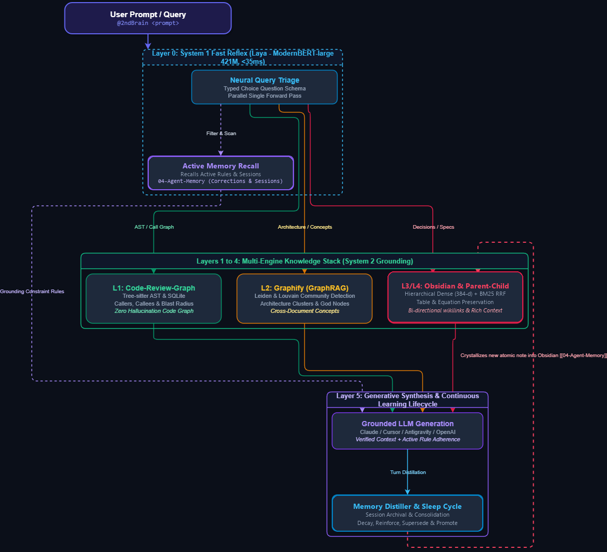
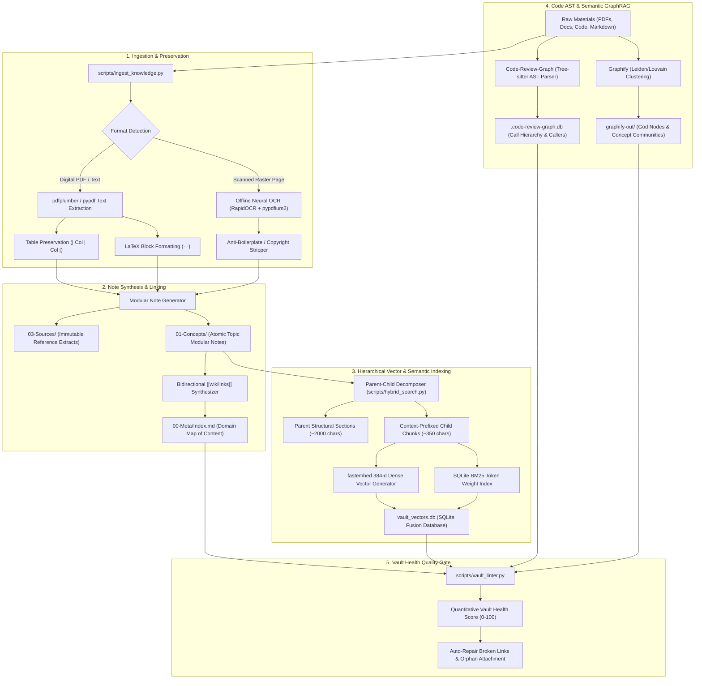
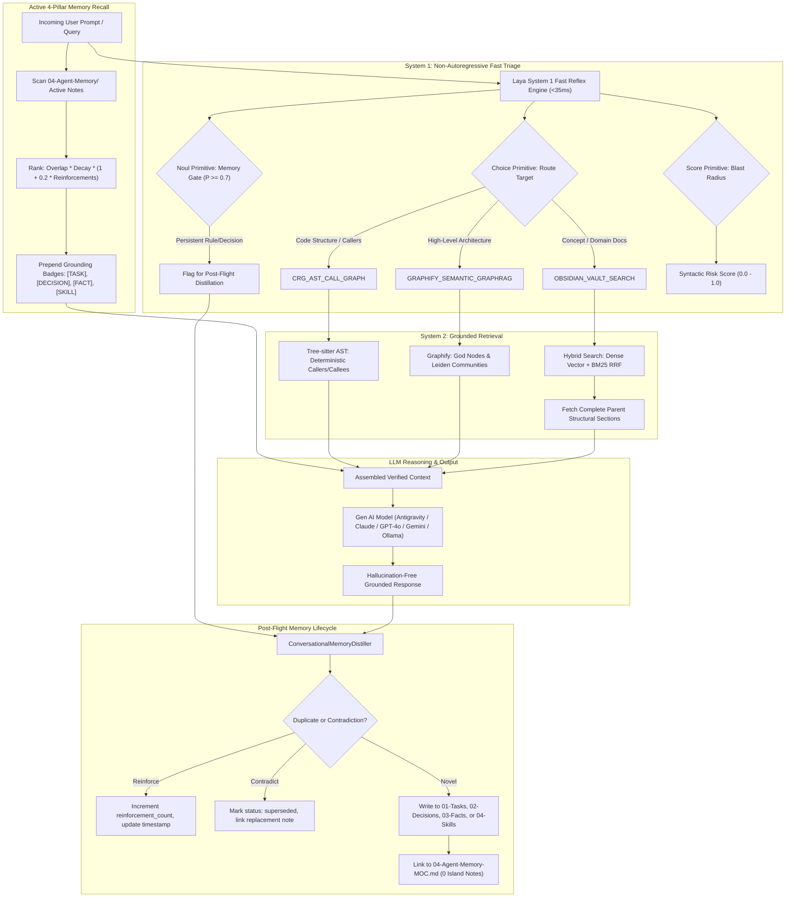

# 🧠 2ndBrain: Dynamic Local-First Second Brain for LLMs

A local-first, dual-process cognitive second brain that turns code, documents, and live conversation turns into a persistent, queryable knowledge engine.

- **Laya** (Convai Innovations): Neural System 1 fast reflex engine powered by **ModernBERT-large (421M)**. Evaluates typed decision schemas (`Choice`, `Score`, `Noul`) in a single parallel forward pass in **~35ms** with zero token generation tax. Optimized with **Focal Loss ($\gamma=2.0$)**, **Vector Temperature Calibration**, and **Isotonic Regression** to achieve **86.67% accuracy** and **0.0798 ECE** (outperforming closed-source Jev cloud APIs). Accompanied by a <0.1ms calibrated heuristic fallback.
- **Code-Review-Graph**: Tree-sitter AST parser and SQLite engine for deterministic call graphs, callers/callees, and Git diff blast radius calculation without model hallucination.
- **Graphify**: Semantic GraphRAG with community detection (Leiden/Louvain algorithms), god nodes, and cross-document concept clustering.
- **Obsidian**: Local markdown vault interconnected via bidirectional `[[wikilinks]]`, persistent Architectural Decision Records (ADRs), and self-evolving conversational memory.
- **Hybrid Search**: Offline 384-d dense vector embeddings (`fastembed` with `BAAI/bge-small-en-v1.5`) fused with BM25 keyword matching via Reciprocal Rank Fusion (RRF) stored in local SQLite.
- **4-Pillar Persistent Memory**: Categorizes long-term memory into `Tasks`, `Decisions`, `Facts`, and `Skills` in Obsidian markdown notes with schema validation, conflict deduplication, and decay-weighted prompt recall.

---

## 🔬 Dual-Process Cognitive Architecture

Standard LLMs suffer from three fundamental limitations:
1. **Context Amnesia**: They forget past instructions, architectural decisions, and user preferences once a conversation turn or session ends.
2. **Structural Hallucination**: When analyzing complex codebases, they guess call graphs and fail to predict breaking changes accurately.
3. **Token Inefficiency**: Ingesting thousands of lines of documentation or code into context windows is slow, expensive, and dilutes attention.

`2ndBrain` solves this by implementing a **Dual-Process Cognitive Architecture** (inspired by Daniel Kahneman's *Thinking, Fast and Slow*):
- **System 1 (Laya - Fast Reflex Engine, ~33–45ms)**: Runs locally. Triage, query routing, document novelty gating, blast-radius risk scoring, and memory distillation happen before calling expensive LLMs.
- **System 2 (Deep Reasoning & Multi-Engine Grounding)**: Combines compiler-grade AST code intelligence, semantic GraphRAG, and a persistent Obsidian markdown vault.

<p align="center">
  
</p>
<p align="center">
  <i>Editable diagrams available in <a href="assets/architecture.drawio">Draw.io XML</a> and <a href="assets/architecture.drawio.svg">Vector SVG</a></i>
</p>

---

## 🧱 The 6 Architectural Layers

| Layer | Engine | Implementation & Models | Primary Responsibility |
| :--- | :--- | :--- | :--- |
| **L0: Fast Reflex** | **Laya** | `models/laya-2ndbrain` (Fine-Tuned ModernBERT-large, 421M) | Evaluates typed questions in a single forward pass without token generation. Routes queries, scores blast risk, gates novelty, and filters conversational memories. Includes a <0.1ms calibrated heuristic fallback and passive Strategy 3 telemetry logging. |
| **L1: Code Structure** | **Code-Review-Graph** | Tree-sitter parsers + SQLite | Deterministic function call trees, callers/callees, import hierarchies, and syntactic blast radius without model hallucination. |
| **L2: Semantic Graph** | **Graphify** | Leiden / Louvain GraphRAG | High-level module boundaries, concept clustering, bridge nodes, and cross-document relational graphs. |
| **L3: Knowledge Vault** | **Obsidian** | Markdown + bidirectional `[[wikilinks]]` | Human-in-the-loop navigation, persistent ADRs, Maps of Content (MOCs), and learned prompt constraints. |
| **L4: Vector Index** | **Hybrid Search** | Parent-Child Hierarchical Dense (`fastembed` BAAI/bge-small-en-v1.5) + SQLite BM25 | Decomposes notes into Parent Sections and matches on granular Child Chunks (~350 chars) with document & section prefixes. Fuses with BM25 via Reciprocal Rank Fusion (RRF) and injects full, rich parent clauses directly to LLMs. |
| **L5: Persistent Memory** | **4-Pillar Memory Ontology** | Local-First Obsidian Markdown + Schema Validation | Categorizes long-term context into `01-Tasks`, `02-Decisions`, `03-Facts`, and `04-Skills` with bidirectional `04-Agent-Memory-MOC.md` linking, confidence scoring, conflict deduplication, and decay-weighted prompt recall. |

---

## 🔄 Lifecycle Flows: How 2ndBrain Works

### Flow 1: Building the Knowledge Base

When you have documents, textbooks, research papers, or codebases and want to assimilate them into the second brain:



#### Step-by-Step Execution:
1. **Drop Source Materials**: Place files into `raw_materials/` (or specify folders in `configs/sources.yaml`).
2. **Run Master Builder**:
   ```bash
   python scripts/build_knowledge_base.py
   ```
   * **Table & Equation Preservation**: `pdfplumber` detects tables and translates them into clean GitHub-flavored markdown tables; formulas and mathematical symbols are wrapped in LaTeX display blocks (`$$ ... $$`).
   * **Local Neural OCR**: If rasterized or scanned pages are detected, local OCR executes automatically via ONNX (`rapidocr-onnxruntime`).
   * **Anti-Boilerplate Stripper**: Publisher copyrights, ISBN blocks, and cataloging text are stripped before note generation ("No AI Slop" standard).
3. **Atomic Concept Generation**:
   * Immutable primary sources are saved in `03-Sources/`.
   * Modular, focused concept notes are synthesized in `01-Concepts/` with YAML frontmatter.
   * Entities and cross-references are dynamically wired together with bidirectional `[[wikilinks]]`.
4. **Parent-Child Vector Embeddings**:
   * Notes are decomposed into logical Parent Sections and subdivided into granular Child Chunks (~350 characters) prefixed with `Document Title > Section Title`.
   * Child vectors (384-d `BAAI/bge-small-en-v1.5`) and BM25 tokens are saved to SQLite `vault_vectors.db`.
5. **GraphRAG & Code AST Compilation**:
   * Tree-sitter builds the function call graph in `.code-review-graph.db`.
   * Graphify runs Leiden community detection to extract high-level god nodes and clusters.
6. **Integrity Audit**:
   * `vault_linter.py` validates link resolution, frontmatter schemas, and returns a verified 0–100 Vault Health Score.

---

### Flow 2: When a User Prompts

When an agent, developer, or user issues a question or command:



#### Step-by-Step Execution:
1. **Pre-Flight Reflex Triage (Laya, <35ms)**:
   * **Target Routing**: Laya evaluates the query using its **Choice** primitive and routes it to Tree-sitter AST, Graphify GraphRAG, or Parent-Child Hybrid Search.
   * **Memory Gating**: Laya's **Noul** primitive detects if the turn establishes an active project preference or rule ($P \ge 0.70$).
   * **Blast Risk**: If modifying code, the **Score** primitive computes a 0.0–1.0 risk index.
2. **Active Constraint Injection**:
   * Scans `04-Agent-Memory/` for non-superseded rules.
   * Applies recency decay and reinforcement weighting:
     $$\text{Score} = \text{Semantic Overlap} \times e^{-\lambda \cdot \Delta t} \times (1 + 0.2 \cdot \text{Reinforcements})$$
   * Injects active constraints directly into the prompt with badges (`[DECISION]`, `[FACT]`, `[SKILL]`, `[TASK]`).
3. **Deterministic Retrieval**:
   * Executes the chosen engine without token hallucination.
   * Hybrid search matches on fine-grained child chunks but delivers **full parent structural sections** so the model receives complete clauses.
4. **Model Deep Reasoning (System 2)**:
   * The LLM reasons over verified AST call graphs and grounded parent documentation.
5. **Post-Flight Memory Distillation & Consolidation**:
   * If a durable rule was detected, it is crystallized into the appropriate pillar note.
   * Restated conventions increment `reinforcement_count`; contradictory statements mark older notes `status: superseded`.
   * Periodic "Sleep Cycle" (`python scripts/sync_brain.py consolidate`) prunes dead rules, merges near-duplicates, and promotes recurring rules into `Project-Guidelines.md`.

---

## 🏛️ 4-Pillar Agent Memory Ontology

Standard memory dumps unstructured conversation turns into a flat vector database, resulting in retrieval noise and memory corruption. `2ndBrain` structures long-term memory into four specialized pillars materialized as local Markdown files:

```text
vault_template/04-Agent-Memory/
├── 01-Tasks/                   # Operational backlogs & milestones (status, priority, due_date)
├── 02-Decisions/               # Architectural Decision Records (ADRs) (rationale, alternatives)
├── 03-Facts/                   # Grounded invariant truths & system specs (confidence: 1.0)
├── 04-Skills/                  # Reusable execution procedures & recipes (trigger, steps)
└── 04-Agent-Memory-MOC.md      # Bidirectional Map of Content (0 island notes)
```

| Pillar | Storage Directory | Frontmatter Metadata Schema | Purpose & Examples |
| :--- | :--- | :--- | :--- |
| **📋 Tasks** | `04-Agent-Memory/01-Tasks/` | `type: task`, `status: pending\|in_progress\|completed`, `priority: high\|medium\|low`, `due_date: YYYY-MM-DD` | Actionable work items, sprint milestones, and execution checklists. |
| **⚖️ Decisions** | `04-Agent-Memory/02-Decisions/` | `type: decision`, `status: active\|superseded`, `confidence: 0.95`, `tags: [adr, memory/decision]` | Architectural choices (e.g. CycloneDDS vs FastDDS), evaluated alternatives, and trade-offs. |
| **📌 Facts** | `04-Agent-Memory/03-Facts/` | `type: fact`, `status: active`, `domain: backend\|systems`, `confidence: 1.0` | Invariant truths, hardware pinouts, baud rates, coordinate frames, and network specs. |
| **🛠️ Skills** | `04-Agent-Memory/04-Skills/` | `type: skill`, `status: active`, `trigger: "condition"`, `tags: [memory/skill]` | Step-by-step procedural execution patterns, zero-copy recipes, and deployment scripts. |

---

## 🔌 Setup Across Different Gen AI Models & Environments

### 1. Google Antigravity
`2ndBrain` includes a native Antigravity skill specification in [`SKILL.md`](SKILL.md).

1. Copy or symlink the repository to your global or local Antigravity skills directory:
   ```bash
   # Windows PowerShell
   Copy-Item -Recurse "2ndBrain" "$env:USERPROFILE\.gemini\config\skills\2ndBrain"

   # Linux / macOS
   cp -r 2ndBrain ~/.gemini/config/skills/2ndBrain
   ```
2. In chat or slash-commands, mention `@2ndBrain`:
   > *"@2ndBrain What did we decide regarding database connection pooling?"*
   Antigravity triggers System 1 reflex routing, injects active memory constraints from `04-Agent-Memory/`, and grounds answers in your Obsidian vault.

---

### 2. Claude Desktop & Claude Code (Anthropic)
`2ndBrain` exposes a high-performance FastMCP server (`scripts/mcp_server.py`) providing 13 native brain tools.

1. Open your Claude configuration file:
   - **Windows**: `%APPDATA%\Claude\claude_desktop_config.json`
   - **macOS**: `~/Library/Application Support/Claude/claude_desktop_config.json`
   - **Linux**: `~/.config/Claude/claude_desktop_config.json`
2. Add the `second-brain` MCP server:
   ```json
   {
     "mcpServers": {
       "second-brain": {
         "command": "python",
         "args": [
           "/absolute/path/to/2ndBrain/scripts/mcp_server.py"
         ],
         "env": {
           "SECOND_BRAIN_VAULT": "/absolute/path/to/2ndBrain/vault_template"
         }
       }
     }
   }
   ```
3. Restart Claude Desktop. Claude now possesses 13 native brain tools:
   * `brain_query`: Intelligent query routed via Laya reflex.
   * `brain_blast_radius`: Tree-sitter AST call graph and risk analysis.
   * `brain_remember_task`: Explicitly registers an actionable item in `01-Tasks/`.
   * `brain_remember_decision`: Records an ADR in `02-Decisions/`.
   * `brain_remember_fact`: Stores an invariant truth in `03-Facts/`.
   * `brain_remember_skill`: Documents a procedural recipe in `04-Skills/`.
   * `brain_recall`: Fetches active constraints relevant to a topic.
   * `brain_consolidate_memory`: Executes the "Sleep Cycle" memory pruner.
   * `brain_sync`, `brain_ingest`, `brain_lint`: Full vault maintenance suite.

---

### 3. Cursor IDE & Windsurf
Connect `2ndBrain` directly into your code editor's agentic loop:

1. Open **Cursor Settings** $\rightarrow$ **Features** $\rightarrow$ **MCP Servers**.
2. Click **Add New MCP Server**:
   - **Name**: `second-brain`
   - **Type**: `command`
   - **Command**: `python "/absolute/path/to/2ndBrain/scripts/mcp_server.py"`
3. In Cursor Composer (`Ctrl + I` / `Cmd + I`):
   > *"@second-brain Check call hierarchy and blast radius before I modify hybrid_search.py"*

---

### 4. Python SDK Integration (`scripts/llm_client.py`)
Use `UniversalBrainAdapter` to wrap API calls with automated pre-flight memory injection and post-flight distillation:

#### A. OpenAI (GPT-4o / o1 / o3)
```python
from scripts.llm_client import UniversalBrainAdapter
import openai

adapter = UniversalBrainAdapter()
user_prompt = "Implement rate limiting middleware for public API endpoints."

# 1. Pre-flight: Injects active project decisions & rules as prompt context
grounded_prompt = adapter.enrich_prompt(user_prompt)

# 2. Call OpenAI with tools
client = openai.OpenAI()
response = client.chat.completions.create(
    model="gpt-4o",
    messages=[{"role": "user", "content": grounded_prompt}],
    tools=adapter.get_openai_tools()
)

# 3. Post-flight: Auto-distill any durable rules established in this turn into Obsidian
adapter.distill_turn(user_prompt, response.choices[0].message.content or "")
```

#### B. Anthropic Claude (Claude 3.7 Sonnet / Opus)
```python
from scripts.llm_client import UniversalBrainAdapter
import anthropic

adapter = UniversalBrainAdapter()
user_prompt = "Refactor token rotation according to our security ADRs."

client = anthropic.Anthropic()
response = client.messages.create(
    model="claude-3-7-sonnet-20250219",
    max_tokens=2048,
    system=adapter.enrich_prompt("You are a principal systems engineer."),
    messages=[{"role": "user", "content": user_prompt}],
    tools=adapter.get_anthropic_tools()
)
```

#### C. Google Gemini (`google-genai` SDK)
```python
from scripts.llm_client import UniversalBrainAdapter
from google import genai

adapter = UniversalBrainAdapter()
client = genai.Client()

user_prompt = adapter.enrich_prompt("Validate our telemetry schema against project standards.")
response = client.models.generate_content(
    model="gemini-2.5-flash",
    contents=user_prompt
)
```

#### D. Local Models (Ollama / DeepSeek-R1 / Llama 3 via OpenAI-Compatible Endpoint)
```python
from scripts.llm_client import UniversalBrainAdapter
import openai

# Point to local Ollama, vLLM, or LM Studio endpoint
client = openai.OpenAI(base_url="http://localhost:11434/v1", api_key="ollama")
adapter = UniversalBrainAdapter()

enriched_prompt = adapter.enrich_prompt("What are our architectural conventions for error handling?")
response = client.chat.completions.create(
    model="llama3.1",
    messages=[{"role": "user", "content": enriched_prompt}]
)
print(response.choices[0].message.content)
```

---

## 🛠️ CLI Quick Reference Guide

The master orchestrator CLI is located at [`scripts/sync_brain.py`](scripts/sync_brain.py):

```bash
# Universal Execution (Linux / macOS / Windows):

# 1. Ingest documents into Obsidian vault (with table & equation preservation)
python scripts/sync_brain.py ingest --source "path/to/documents"

# 2. Synchronize all graph engines (AST + Graphify + fastembed Vectors + Obsidian)
python scripts/sync_brain.py sync --target "."

# 3. Intelligent query routed by Laya (System 1) with Parent-Child search & active memory recall
python scripts/sync_brain.py query "How is authentication handled and who calls it?"

# 4. Compute AST blast radius and callers for a symbol or file
python scripts/sync_brain.py blast <function_or_class_name>
python scripts/sync_brain.py blast --file "path/to/module.py"

# 5. Explicitly crystallize a durable memory across pillars (--category: task, decision, fact, skill)
python scripts/sync_brain.py remember "Always use Pydantic models for validation" --category fact --tag "architecture"
python scripts/sync_brain.py remember "Adopt CycloneDDS over FastDDS for lower packet loss" --category decision --tag "networking"
python scripts/sync_brain.py remember "Calibrate sensor extrusion matrix" --category task --tag "sensors"
python scripts/sync_brain.py remember "Zero-copy shared memory pattern" --category skill --tag "systems"

# 6. Archive a conversation dialogue or meeting into persistent memory
python scripts/sync_brain.py session --topic "Architecture Review" --summary "Decided on gRPC interfaces." --decisions "Use protobuf v3"

# 7. Run Memory Consolidation ("Sleep Cycle") to prune, merge, and promote rules
python scripts/sync_brain.py consolidate
python scripts/sync_brain.py consolidate --dry-run

# 8. Distill durable rules and decisions from a chat transcript
python scripts/sync_brain.py distill --transcript "path/to/transcript.jsonl"

# 9. Audit vault health, broken wikilinks, and unindexed notes
python scripts/sync_brain.py lint

# 10. Auto-repair high-confidence broken links and register orphan notes
python scripts/sync_brain.py lint --fix

# 11. Create & manage atomic GSD work-units (Max 45m timebox, binary DOD)
python scripts/gsd_task.py create "Implement Rate Limiter" --goal "Add Token Bucket middleware" --timebox 30m
python scripts/gsd_task.py list
python scripts/gsd_task.py start "implement_rate_limiter"
python scripts/gsd_task.py done "implement_rate_limiter"

# 12. Run Master Knowledge Base Builder (Auto-discovery or config manifest)
python scripts/build_knowledge_base.py
```

---

## 📂 Repository Scaffolding

```text
2ndBrain/
├── SKILL.md                  # Antigravity skill definition (copy to ~/.gemini/config/skills/2ndBrain)
├── README.md                 # Complete system documentation & capabilities guide
├── requirements.txt          # Python dependencies (laya, torch, fastembed, FastMCP, pypdf)
├── .gitignore                # Protects models, databases, caches, and private notes
├── assets/                   # Architecture diagrams and vector visual assets
│   ├── architecture.drawio   # Native Draw.io XML architecture source
│   ├── architecture.drawio.png # Visual graphic embedded in documentation
│   └── knowledge_pipeline.drawio # Knowledge ingestion lifecycle topology
├── configs/                  # Client configurations for every major LLM platform
│   ├── sources.example.yaml  # Ingestion manifest template (copy to sources.local.yaml)
│   ├── claude_desktop_config.json # Claude Desktop & Claude Code MCP configuration
│   ├── cursor_mcp.json       # Cursor IDE & Windsurf MCP configuration
│   ├── CLAUDE.md             # Native developer instructions for Claude Code
│   ├── .cursorrules          # Project rules for Cursor IDE
│   └── SYSTEM_PROMPT.md      # Grounding prompt for Web UIs (ChatGPT, Claude.ai, Ollama)
├── notebooks/
│   └── train_laya_kaggle.ipynb # Ready-to-run Kaggle 2x T4 DDP notebook for cloud GPU scaling
├── scripts/
│   ├── build_knowledge_base.py # Master builder (recursive auto-discovery or config manifest)
│   ├── laya_router.py        # System 1 Neural Decision Engine (ModernBERT-large 421M + Isotonic Calibration)
│   ├── generate_laya_dataset.py # 1,600+ sample synthetic dataset generator with borderline ambiguity
│   ├── train_laya.py         # Advanced Focal Loss & Vector Temperature training pipeline
│   ├── hybrid_search.py      # Local-First Hybrid Search Engine (Parent-Child Dense + BM25 RRF)
│   ├── memory_distiller.py   # Conversational Memory Distiller (Decay, Reinforce, Supersede, Archival)
│   ├── vault_linter.py       # Vault Health & Link Integrity Linter (Quantitative 0-100 Score)
│   ├── mcp_server.py         # Universal FastMCP Server exposing 13 brain tools (including 4 memory pillars)
│   ├── llm_client.py         # Universal Python SDK adapter (OpenAI, Anthropic, Gemini, Ollama)
│   ├── ingest_knowledge.py   # Document Ingestion Engine (Digital PDFs, Tables, Equations, Neural OCR)
│   ├── gsd_task.py           # GSD Task Engine (Atomic work-units, timeboxing, rollback plans)
│   ├── install_git_hooks.py  # Installs pre-commit quality gate
│   ├── pre_commit_hook.py    # Enforces Rule 5 Git isolation and vault integrity before commit
│   └── sync_brain.py         # Master CLI orchestrator (10 subcommands)
└── vault_template/           # Obsidian vault scaffolding
    ├── 00-Meta/              # Index.md (MOC), system rules, and SQLite vector DB
    ├── 01-Concepts/          # Architecture nodes, specifications, and synthesized concepts
    ├── 02-Codebase/          # AST module summaries and blast radius reviews
    ├── 03-Sources/           # Complete source extracts, meeting notes, and literature
    └── 04-Agent-Memory/      # 4-Pillar agent memory ontology, telemetry logs, session archives, and reports
        ├── 01-Tasks/         # Actionable work items, sprint backlogs, and status tracking
        ├── 02-Decisions/     # Architectural Decision Records (ADRs) with trade-offs
        ├── 03-Facts/         # Invariant truths, system groundings, and specifications
        ├── 04-Skills/        # Procedural execution recipes and zero-copy code patterns
        └── 04-Agent-Memory-MOC.md # Bidirectional Map of Content (0 island notes)
```

---

## 🛡️ Grounding & Integrity Principles
- **Zero Token Waste**: Fast reflex routing runs via Laya ModernBERT in <45ms without burning API tokens.
- **No Hallucinated Edges**: Call hierarchies and blast radii are computed deterministically via Tree-sitter AST.
- **Human Transparency**: Every concept and learned memory is stored in transparent, human-editable Obsidian Markdown notes.
- **Decay & Conflict Protection**: Stale rules decay over time, and contradictory instructions automatically supersede older records with bidirectional links.
- **Git Isolation**: The repository tracks framework code, tooling, and scaffolding only; private domain knowledge and personal notes remain local.
