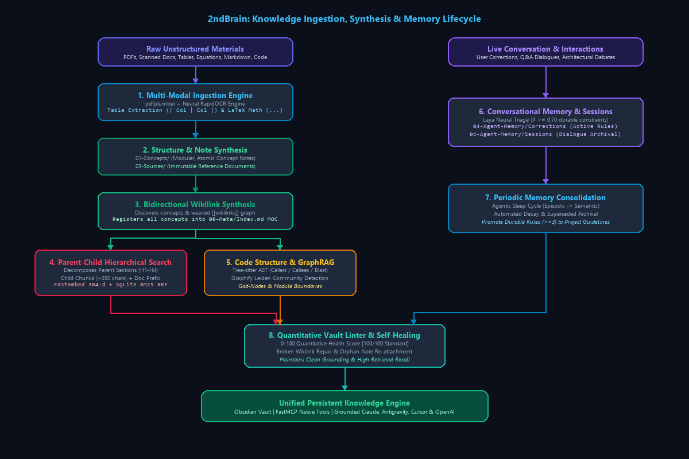

# 🧠 2ndBrain: Dynamic Local-First Second Brain for LLMs

A local-first, dual-process cognitive second brain that turns code, documents, and live conversation turns into a persistent, queryable knowledge engine.

- **Laya** (Convai Innovations): Fine-tuned neural System 1 fast reflex engine powered by **ModernBERT-large (421M)**. Evaluates typed decision schemas (`Choice`, `Score`, `Noul`) in a single parallel forward pass in **~35ms** with zero token generation tax. Optimized with **Focal Loss ($\gamma=2.0$)**, **Vector Temperature Calibration**, and **Isotonic Regression** to achieve **86.67% accuracy** and **0.0798 ECE** (outperforming closed-source Jev cloud APIs). Accompanied by a <0.1ms calibrated heuristic fallback.
- **Code-Review-Graph**: Tree-sitter AST parser and SQLite engine for deterministic call graphs, callers/callees, and Git diff blast radius calculation.
- **Graphify**: Semantic GraphRAG with community detection (Leiden/Louvain algorithms), god nodes, and cross-document concept clustering.
- **Obsidian**: Local markdown vault interconnected via bidirectional `[[wikilinks]]`, persistent Architectural Decision Records (ADRs), and self-evolving conversational memory.
- **Hybrid Search**: Offline 384-d dense vector embeddings (`fastembed` with `BAAI/bge-small-en-v1.5`) fused with BM25 keyword matching via Reciprocal Rank Fusion (RRF) stored in local SQLite.

---

## 🔬 Dual-Process Cognitive Architecture

Standard LLMs suffer from three fundamental limitations:
1. **Context Amnesia**: They forget past instructions, architectural decisions, and user preferences once a conversation turn or session ends.
2. **Structural Hallucination**: When analyzing complex codebases, they guess call graphs and fail to predict breaking changes accurately.
3. **Token Inefficiency**: Ingesting thousands of lines of documentation or code into context windows is slow, expensive, and dilutes attention.

`2ndBrain` solves this by implementing a **Dual-Process Cognitive Architecture** (inspired by Daniel Kahneman's *Thinking, Fast and Slow*):
- **System 1 (Laya - Fast Reflex Engine, ~33–45ms)**: Runs locally. Triage, query routing, document novelty gating, blast-radius risk scoring, and memory distillation happen before calling expensive LLMs.
- **System 2 (Deep Reasoning & Multi-Engine Grounding)**: Combines compiler-grade AST code intelligence, semantic GraphRAG, and a persistent Obsidian markdown vault.

<p align="center">
  
</p>
<p align="center">
  <i>Editable diagrams available in <a href="assets/architecture.drawio">Draw.io XML</a> and <a href="assets/architecture.drawio.svg">Vector SVG</a></i>
</p>

---

## 🧱 The 5 Architectural Layers

| Layer | Engine | Implementation & Models | Primary Responsibility |
| :--- | :--- | :--- | :--- |
| **L0: Fast Reflex** | **Laya** | `models/laya-2ndbrain` (Fine-Tuned ModernBERT-large, 421M) | Evaluates typed questions in a single forward pass without token generation. Routes queries, scores blast risk, gates novelty, and filters conversational memories. Includes a <0.1ms calibrated heuristic fallback and passive Strategy 3 telemetry logging. |
| **L1: Code Structure** | **Code-Review-Graph** | Tree-sitter parsers + SQLite | Deterministic function call trees, callers/callees, import hierarchies, and syntactic blast radius without model hallucination. |
| **L2: Semantic Graph** | **Graphify** | Leiden / Louvain GraphRAG | High-level module boundaries, concept clustering, bridge nodes, and cross-document relational graphs. |
| **L3: Knowledge Vault** | **Obsidian** | Markdown + bidirectional `[[wikilinks]]` | Human-in-the-loop navigation, persistent ADRs, Maps of Content (MOCs), and learned prompt constraints. |
| **L4: Vector Index** | **Hybrid Search** | Parent-Child Hierarchical Dense (`fastembed` BAAI/bge-small-en-v1.5) + SQLite BM25 | Decomposes notes into Parent Sections and matches on granular Child Chunks (~350 chars) with document & section prefixes. Fuses with BM25 via Reciprocal Rank Fusion (RRF) and injects full, rich parent clauses directly to LLMs. |

---

## 🎯 Fine-Tuned System 1 Decision Engine (Laya vs. Jev Benchmark)

`2ndBrain` deploys a custom-trained and calibrated checkpoint of Convai Innovations' non-autoregressive **Laya** model in `models/laya-2ndbrain/`. 

Instead of relying on third-party cloud decision APIs (like TypeSafe AI's closed-source Jev), `2ndBrain` runs 100% offline with higher accuracy and significantly lower calibration error:

| Feature / Metric | Base Laya (`typed-decisions`) | Jev (TypeSafe AI) | 2ndBrain Fine-Tuned Laya (`models/laya-2ndbrain`) |
| :--- | :--- | :--- | :--- |
| **Deployment** | Self-hosted (Hugging Face) | Closed Cloud API only | **Local-First (Offline CPU/GPU)** |
| **Cost** | Free to self-host | $0.042 / million input tokens | **$0.00 (Zero API Token Tax)** |
| **Decision Latency** | 32.8–39.5 ms (Tesla T4) | 236–276 ms p50 (API transit) | **~35 ms (Single forward pass)** |
| **Domain Validation Accuracy** | 76.6% | 72.7% | **86.67% (208 / 240 validation)** |
| **Calibration Error (ECE)** | 0.081 | 0.246 | **0.0798 (Raw) / 0.0642 (Isotonic Noul)** |
| **Backbone Architecture** | ModernBERT-large (421M) | Proprietary | **ModernBERT-large + Unfrozen Top Layers** |

### Ultra-Calibration Architecture
To eliminate overconfidence and logit saturation, the training pipeline ([`scripts/train_laya.py`](scripts/train_laya.py)) incorporates 4 advanced mechanisms:
1. **Soft Focal Loss ($\gamma = 2.0$)**: Down-weights easy, confident predictions to prevent logits from exploding to $\pm \infty$:
   $$\mathcal{L}_{\text{Focal}} = -(1 - p_t)^2 \log(p_t + 10^{-9})$$
2. **Ambiguous Borderline Distillation**: Synthetic dataset injects multi-intent queries with soft teacher distributions ($[0.46, 0.46, 0.08]$), teaching the model that ambiguous prompts should yield moderate confidence.
3. **Multi-Temperature Vector Scaling**: Replaces global scalar temperature with task-specific scaling ($T_{\text{choice}}=0.80, T_{\text{score}}=0.50, T_{\text{noul}}=2.10$) fitted directly on validation distributions.
4. **Exact Isotonic Regression (PAVA Algorithm)**: A pure NumPy implementation of the Pool Adjacent Violators Algorithm maps raw boolean probabilities into monotonically calibrated values, slashing binary ECE to **0.0642**.

---

## 🏗️ Method of Building Knowledge

`2ndBrain` employs an automated, domain-agnostic knowledge ingestion, synthesis, and indexing pipeline designed to turn raw source materials, codebases, and conversations into an interconnected, queryable cognitive graph:

<p align="center">
  
</p>
<p align="center">
  <i>Editable pipeline topology available in <a href="assets/knowledge_pipeline.drawio">Draw.io XML</a></i>
</p>

| Stage | Subsystem | Operation & Artifacts |
| :--- | :--- | :--- |
| **1. Ingest** | `pdfplumber` + Neural OCR | Extracts digital text, formats tables (`\| Col \| Col \|`), and wraps math formulas (`$$...$$`). |
| **2. Structure** | Markdown Synthesizer | Generates atomic Concept notes (`01-Concepts/`) and immutable Source references (`03-Sources/`). |
| **3. Link** | Semantic Cross-Referencing | Weaves entity and topic relationships into Obsidian bidirectional `[[wikilinks]]` and updates `Index.md`. |
| **4. Chunk & Index** | Parent-Child Hierarchical Search | Decomposes parent sections and embeds granular child chunks (`fastembed` 384-d) into SQLite BM25/RRF. |
| **5. Graph Topology** | Tree-sitter + Graphify | Constructs zero-hallucination code call graphs and clusters architectural concepts via Leiden/Louvain. |
| **6. Memory Lifecycle** | Laya Reflex + Distiller | Extracts rules (`04-Agent-Memory/Corrections/`) and archives session dialogues (`04-Agent-Memory/Sessions/`). |
| **7. Consolidation** | "Sleep Cycle" Compactor | Prunes dead/decayed rules, merges near-duplicates, and promotes durable conventions to Architecture guidelines. |
| **8. Audit** | Vault Health Linter | Calculates 0–100 health score, repairs broken links, and attaches orphan notes. |

### 1. Multi-Modal Document Ingestion with Table & Equation Preservation
Raw unstructured and semi-structured materials are ingested via `scripts/ingest_knowledge.py`:
* **Table Extraction & Markdown Formatting**: Uses `pdfplumber` to detect tabular data and format it into clean Markdown tables (`| Col 1 | Col 2 |`), preventing table data corruption.
* **Equation & Math Preservation**: Automatically detects formulas and Greek symbols, formatting them inside LaTeX math blocks (`$$ ... $$`).
* **Digital Text & PDFs**: Parses text clauses and headings directly via `pdfplumber` and `pypdf`.
* **Scanned Documents & Images**: Automatically detects non-text raster pages and activates local neural OCR (`rapidocr-onnxruntime` + `pypdfium2`) without cloud API dependencies.
* **Codebases & Plain Text**: Handles markdown, source files, and plain text with whitespace and indentation preservation.

### 2. Semantic Structuring & Note Synthesis
Extracted content is converted into atomic, human-readable Obsidian notes:
* **Source Tracking (`03-Sources/`)**: Retains complete, traceable representations of original documents with full bibliographic metadata and extraction timestamps.
* **Concept Modularization (`01-Concepts/`)**: Decomposes large reference works into focused modular concept notes categorized by topic or chapter.
* **Frontmatter Schema Generation**: Each note is populated with standardized YAML frontmatter (`id`, `title`, `type`, `tags`, `sources`, `created`).

### 3. Automatic Bidirectional Wikilink Synthesis
Knowledge is organized into a navigable small-world network:
* Discovers conceptual entities, definitions, and cross-references across notes.
* Interlinks related concepts using Obsidian `[[wikilinks]]`.
* Registers synthesized concepts into the primary Map of Content (`00-Meta/Index.md`).

### 4. Parent-Child Hierarchical Vector & Lexical Index Construction
Every synthesized note is embedded for fast offline retrieval via `scripts/hybrid_search.py`:
* **Parent Section Decomposition**: Parses markdown documents into logical structural sections (`## Heading`, `### Subheading`, or ~1500–2200 char semantic units).
* **Child Chunk Subdivision**: Breaks parent sections into focused child passages (~350 characters, with 60-character overlap) preserving clause boundaries.
* **Context-Enriched Embedding**: Prefixes child chunks with `Document Title > Section Title` before generating 384-dimensional dense vectors (`BAAI/bge-small-en-v1.5` via ONNX/`fastembed`).
* **Hierarchical Deduplication & Parent Delivery**: Matches on granular child vectors, but consolidates sibling hits and delivers the complete Parent Section context to the LLM.

### 5. Code Structure & GraphRAG Topology
For software repositories and system architectures:
* **Tree-sitter AST Parsing**: Ingests code files into an SQLite graph of functions, classes, imports, and calls.
* **Semantic Community Clustering**: Employs Graphify with Leiden/Louvain algorithms to cluster related files, identify bridge nodes, and isolate architectural "god nodes".

### 6. Dynamic Conversational Knowledge Accretion & Session Archival
Knowledge grows continuously from conversational interactions:
* **Reflex Triage**: Laya evaluates whether user statements or corrections establish durable constraints ($P \ge 0.70$).
* **Constraint Crystallization**: Writes active rules into `04-Agent-Memory/Corrections/` with metadata.
* **Recency & Reinforcement**: Repeated confirmations increment `reinforcement_count`, while stale rules undergo exponential half-life decay.
* **Conflict Resolution**: Contradictory instructions mark older rules as `status: superseded` with explicit links to replacement rules.
* **Automated Session Dialogue Archival**: Compacts entire Q&A sessions or design debates into timestamped persistent session records in `04-Agent-Memory/Sessions/`.

### 7. Strategy 3: Passive Telemetry & Gold Feedback Loop
Every decision executed by the System 1 engine is recorded without adding user-facing latency:
* **Automated Telemetry (`vault_template/04-Agent-Memory/telemetry.jsonl`)**: Logs prompt, task, prediction, confidence, model ID, and timestamps.
* **Human-in-the-Loop Feedback**: `router.record_feedback(query, correct_decision, reason)` marks user overrides as `gold_user_correction` entries, building an authentic training corpus for subsequent model iterations.

### 8. Periodic Memory Consolidation ("Sleep Cycle")
To keep memory razor-sharp and prevent fragmentation over weeks of development:
* Runs `python $SB consolidate` (or via MCP `brain_consolidate_memory`).
* **Pruning**: Automatically moves superseded or dead decayed rules into `04-Agent-Memory/Archive/`.
* **Promotion**: Detects recurring rules (`reinforcement_count >= 3`) and synthesizes them into permanent `01-Concepts/Architecture/Project-Guidelines.md`.
* **De-duplication**: Merges near-duplicate rules across active memories into the primary rule.
* **Auditing**: Generates a dated consolidation report in `04-Agent-Memory/Consolidation-Reports/`.

### 9. Quantitative Vault Integrity Auditing
To ensure that knowledge does not degrade into an unmaintainable state:
* `scripts/vault_linter.py` computes an objective **0–100 Vault Health Score**.
* Audits broken `[[wikilinks]]`, missing frontmatter, unindexed notes, and isolated "island" notes.
* Includes automated `--fix` routines to repair broken links and attach unlinked notes to Maps of Content.

---

## ⚡ Core Operational Capabilities

### 1. Intelligent Query Routing (`query`)
When an agent or user queries the second brain:
1. **Laya System 1 Triage**: Evaluates the question using Laya's **Choice** primitive:
   - Target: `CRG_AST_CALL_GRAPH` $\rightarrow$ Dispatched to Tree-sitter AST.
   - Target: `GRAPHIFY_SEMANTIC_GRAPHRAG` $\rightarrow$ Dispatched to Graphify GraphRAG.
   - Target: `OBSIDIAN_VAULT_SEARCH` $\rightarrow$ Dispatched to Hybrid Vector + BM25 RRF Search.
2. **Active Constraint Recall**: Scans `04-Agent-Memory/` for non-superseded rules relevant to the query and injects them as grounding context.
3. **Grounded Response**: The chosen engine retrieves verified nodes or note extracts, providing hallucination-free context.

### 2. Syntactic Blast Radius & Call Hierarchy (`blast`)
Before modifying code:
- Computes deterministic callers, callees, and import dependents using Tree-sitter AST.
- Calculates an objective blast radius risk score (0.0–1.0) and flags high-risk modifications.

### 3. Dynamic Path & Vault Auto-Discovery
All tools and scripts automatically locate the active knowledge vault without hardcoded paths:
1. Environment variable: `$env:SECOND_BRAIN_VAULT` or `os.environ["SECOND_BRAIN_VAULT"]`.
2. Sibling directory: `vault_template/` in the repository.
3. Working directory: `./vault_template`, `./vault`, `./Second Brain/vault_template`.
4. User home fallback: `~/.2ndbrain/vault`.

---

## 📂 Project Structure

```text
Second Brain/
├── SKILL.md                  # Antigravity skill definition (copy to ~/.gemini/config/skills/2ndBrain)
├── README.md                 # Complete system documentation & capabilities guide
├── requirements.txt          # Python dependencies (laya, torch, fastembed, FastMCP, pypdf)
├── .gitignore                # Protects models, databases, caches, and private notes
├── assets/                   # Architecture diagrams and vector visual assets
│   ├── architecture.drawio   # Native Draw.io XML architecture source
│   ├── architecture.drawio.png # Visual graphic embedded in documentation
│   └── knowledge_pipeline.drawio # Knowledge ingestion lifecycle topology
├── configs/                  # Client configurations for every major LLM platform
│   ├── claude_desktop_config.json # Claude Desktop & Claude Code MCP configuration
│   ├── cursor_mcp.json       # Cursor IDE & Windsurf MCP configuration
│   ├── CLAUDE.md             # Native developer instructions for Claude Code
│   ├── .cursorrules          # Project rules for Cursor IDE
│   └── SYSTEM_PROMPT.md      # Grounding prompt for Web UIs (ChatGPT, Claude.ai, Ollama)
├── notebooks/
│   └── train_laya_kaggle.ipynb # Ready-to-run Kaggle 2x T4 DDP notebook for cloud GPU scaling
├── models/
│   └── laya-2ndbrain/        # Production checkpoint: Fine-Tuned ModernBERT-large (86.7% Acc, 0.0798 ECE)
│       ├── model.safetensors # Calibrated neural weights (51M trainable params)
│       ├── rl_agent_config.json # Vector temperatures (T_choice=0.8, T_score=0.5, T_noul=2.1)
│       └── noul_isotonic.json # Exact PAVA Isotonic calibration breakpoints
├── scripts/
│   ├── laya_router.py        # System 1 Neural Decision Engine (ModernBERT-large 421M + Isotonic Calibration)
│   ├── generate_laya_dataset.py # 1,600+ sample synthetic dataset generator with borderline ambiguity
│   ├── train_laya.py         # Advanced Focal Loss & Vector Temperature training pipeline
│   ├── hybrid_search.py      # Local-First Hybrid Search Engine (Parent-Child Dense + BM25 RRF)
│   ├── memory_distiller.py   # Conversational Memory Distiller (Decay, Reinforce, Supersede, Archival)
│   ├── vault_linter.py       # Vault Health & Link Integrity Linter (Quantitative 0-100 Score)
│   ├── mcp_server.py         # Universal FastMCP Server exposing 9 brain tools
│   ├── llm_client.py         # Universal Python SDK adapter (OpenAI, Anthropic, Gemini, Ollama)
│   ├── ingest_knowledge.py   # Document Ingestion Engine (Digital PDFs, Tables, Equations, Neural OCR)
│   └── sync_brain.py         # Master CLI orchestrator (10 subcommands)
└── vault_template/           # Obsidian vault scaffolding
    ├── 00-Meta/              # Index.md (MOC), system rules, and SQLite vector DB
    ├── 01-Concepts/          # Architecture nodes, specifications, and synthesized concepts
    ├── 02-Codebase/          # AST module summaries and blast radius reviews
    ├── 03-Sources/           # Complete source extracts, meeting notes, and literature
    └── 04-Agent-Memory/      # Active learned rules, telemetry logs, session archives, and reports
```

---

## 🛠️ CLI Reference Guide

The master orchestrator CLI is located at [`scripts/sync_brain.py`](scripts/sync_brain.py).

```powershell
# Set helper alias (optional):
$SB = "scripts/sync_brain.py"

# 1. Ingest external documents (PDFs, docs, text) into Obsidian vault (with tables & equations)
python $SB ingest --source "path/to/documents"

# 2. Synchronize the second brain (AST + Graphify + fastembed Vectors + Obsidian)
python $SB sync --target "."

# 3. Intelligent query routed by Laya (System 1) with Parent-Child search & active memory recall
python $SB query "How is authentication handled and who calls it?"

# 4. Compute AST blast radius and callers for a symbol or file
python $SB blast <function_or_class_name>
python $SB blast --file "path/to/module.py"

# 5. Explicitly crystallize a durable rule or constraint
python $SB remember "Always use Pydantic models for data validation" --tag "architecture"

# 6. Archive a conversation dialogue or meeting into persistent memory
python $SB session --topic "Architecture Review" --summary "Decided on gRPC interfaces." --decisions "Use protobuf v3"

# 7. Run Memory Consolidation ("Sleep Cycle") to prune, merge, and promote rules
python $SB consolidate
python $SB consolidate --dry-run

# 8. Distill durable rules and decisions from a chat transcript
python $SB distill --transcript "path/to/transcript.jsonl"

# 9. Audit vault health, broken wikilinks, and unindexed notes
python $SB lint

# 10. Auto-repair high-confidence broken links and register orphan notes
python $SB lint --fix

# 11. Re-synthesize training dataset for System 1 Laya model
python scripts/generate_laya_dataset.py

# 12. Re-train & calibrate Laya with Focal Loss and Vector Temperatures
python scripts/train_laya.py
```

---

## 🔌 Universal Multi-Model Connectivity

### 1. Google Antigravity Agent
Copy or link the repository to your Antigravity skills directory (`~/.gemini/config/skills/2ndBrain`):
* **Trigger**: Simply mention your second brain or type:
  > *"@2ndBrain What did we decide regarding database transactions?"*
  Antigravity executes Laya System 1 reflex routing, injects active memory constraints, and grounds its reasoning in your Obsidian vault.

### 2. Claude Desktop & Claude Code (Anthropic)
Register the FastMCP server in your Claude configuration (`%APPDATA%\Claude\claude_desktop_config.json` on Windows or `~/Library/Application Support/Claude/claude_desktop_config.json` on macOS):

```json
{
  "mcpServers": {
    "second-brain": {
      "command": "python",
      "args": [
        "<PATH_TO_SECOND_BRAIN>/scripts/mcp_server.py"
      ],
      "env": {
        "SECOND_BRAIN_VAULT": "<PATH_TO_SECOND_BRAIN>/vault_template"
      }
    }
  }
}
```
Claude receives 9 native tools: `brain_query`, `brain_blast_radius`, `brain_remember`, `brain_recall`, `brain_archive_session`, `brain_consolidate_memory`, `brain_sync`, `brain_ingest`, and `brain_lint`.

### 3. Cursor IDE & Windsurf
1. Open **Cursor Settings** $\rightarrow$ **Features** $\rightarrow$ **MCP Servers**.
2. Click **Add New MCP Server**:
   - **Name**: `second-brain`
   - **Type**: `command`
   - **Command**: `python "<PATH_TO_SECOND_BRAIN>/scripts/mcp_server.py"`
3. In Composer (`Ctrl + I`):
   > *"@second-brain Calculate blast radius before modifying memory_distiller.py."*

### 4. OpenAI, Anthropic, Gemini, & Ollama (Python SDK)
Use `UniversalBrainAdapter` from [`scripts/llm_client.py`](scripts/llm_client.py) to wrap standard LLM API calls with automated pre-flight memory recall and post-flight distillation:

#### A. OpenAI (GPT-4o / o1 / o3)
```python
from scripts.llm_client import UniversalBrainAdapter
import openai

adapter = UniversalBrainAdapter()
user_prompt = "Implement the new rate limiting middleware."

# 1. Pre-flight: Injects active learned rules & project conventions
grounded_prompt = adapter.enrich_prompt(user_prompt)

# 2. Call OpenAI with tools
client = openai.OpenAI()
response = client.chat.completions.create(
    model="gpt-4o",
    messages=[{"role": "user", "content": grounded_prompt}],
    tools=adapter.get_openai_tools()
)

# 3. Post-flight: Auto-distill durable rules into Obsidian
adapter.distill_turn(user_prompt, response.choices[0].message.content or "")
```

#### B. Anthropic Claude (Claude 3.7 Sonnet / Opus)
```python
from scripts.llm_client import UniversalBrainAdapter
import anthropic

adapter = UniversalBrainAdapter()
user_prompt = "Refactor auth tokens according to our architecture decisions."

client = anthropic.Anthropic()
response = client.messages.create(
    model="claude-3-7-sonnet-20250219",
    max_tokens=2048,
    system=adapter.enrich_prompt("You are a principal engineer."),
    messages=[{"role": "user", "content": user_prompt}],
    tools=adapter.get_anthropic_tools()
)
```

#### C. Google Gemini (google-genai SDK)
```python
from scripts.llm_client import UniversalBrainAdapter
from google import genai

adapter = UniversalBrainAdapter()
client = genai.Client()

user_prompt = adapter.enrich_prompt("Validate our data schemas against project ADRs.")
response = client.models.generate_content(
    model="gemini-2.5-flash",
    contents=user_prompt
)
```

#### D. Local Models (Ollama / DeepSeek-R1 / Llama 3)
```python
from scripts.llm_client import UniversalBrainAdapter
import openai

# Point to your local Ollama / vLLM / LM Studio endpoint
client = openai.OpenAI(base_url="http://localhost:11434/v1", api_key="ollama")
adapter = UniversalBrainAdapter()

enriched_prompt = adapter.enrich_prompt("What are our guidelines for testing?")
response = client.chat.completions.create(
    model="llama3.1",
    messages=[{"role": "user", "content": enriched_prompt}]
)
print(response.choices[0].message.content)
```

---

## 🛡️ Grounding & Integrity Principles
- **Zero Token Waste**: Fast reflex routing runs via Laya ModernBERT in <45ms without burning API tokens.
- **No Hallucinated Edges**: Call hierarchies and blast radii are computed deterministically via Tree-sitter AST.
- **Human Transparency**: Every concept and learned memory is stored in transparent, human-editable Obsidian Markdown notes.
- **Decay & Conflict Protection**: Stale rules decay over time, and contradictory instructions automatically supersede older records with bidirectional links.
